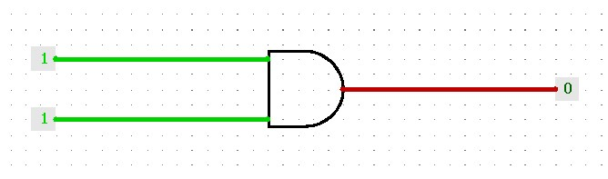

# Logisim-Circuit-Tester

# User Guide
Tests input are written in file.  
Currently supported Formats are JSON.

## Input formats
# JSON
TestCase
: TestCase is a dictionay, which key's are label of input/	output *Pin* Component and value's are hex/binary represented string.  
Test file contains an array of TestCase

### Example:
Single Test :
```
	[
		{
			"in1":"0x12",
			"in2":"0b10101010",
		}
	]
```
Explanation:
- *Pin* with label "in1" would be converted to *Constant* component and that Constant will have value 12<sub>hex</sub>.

- *Pin* with label "in2" would be converted to *Constant* component and that Constant will have value 10101010<sub>binary</sub>.

Multiple Test:
```
	[
		{
			"input 1" : "0x123",
			"input 2" : "0x456",
			"output 1" : "0x789",
		},
		{
			"input 1" : "0xabc",
			"input 2" : "0xdef",
		}
	]
```
## Running Logisim-Circuit-Tester
- Download *Logisim-Circuit-Tester.jar*  
- Make sure *logisim-generic-2.7.1.jar* are in same folder
- > java -jar Logisim-circuit-Tester.jar --help

# Background

Logisim[^1] saves circuits as .circ xml file. 
Most of circuit has Input and outpt as *Pin* component.
There are also *Constant* component which accept hex/binary number as input. 
But *Pin* component doesnot accept number as input.

What if for a given circuit we change our intended input/output *Pin* component to *Constant* component and assign number to that constant? It works

So, We change input *Pin* component to *Constant* component and set input value, then load logisim with modified circuit. Logisim will comput output value from input *Constant* values.(No need to manually input value , hard work gone)

If output *Pin* component is changed accordingly , Then output value can be verified by monitoring color of wire.




# Tasklist

[^1]: logisim-generic-2.7.1.jar is attached from [latest release](https://sourceforge.net/projects/circuit/files/2.7.x/2.7.1/)